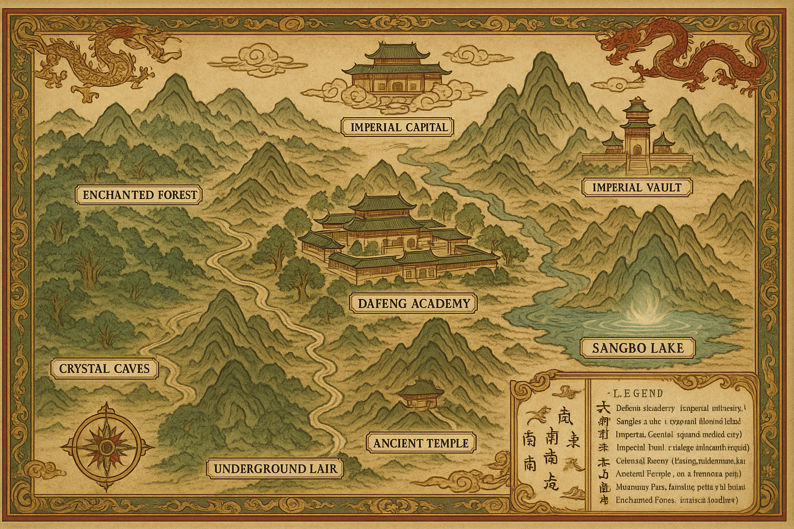
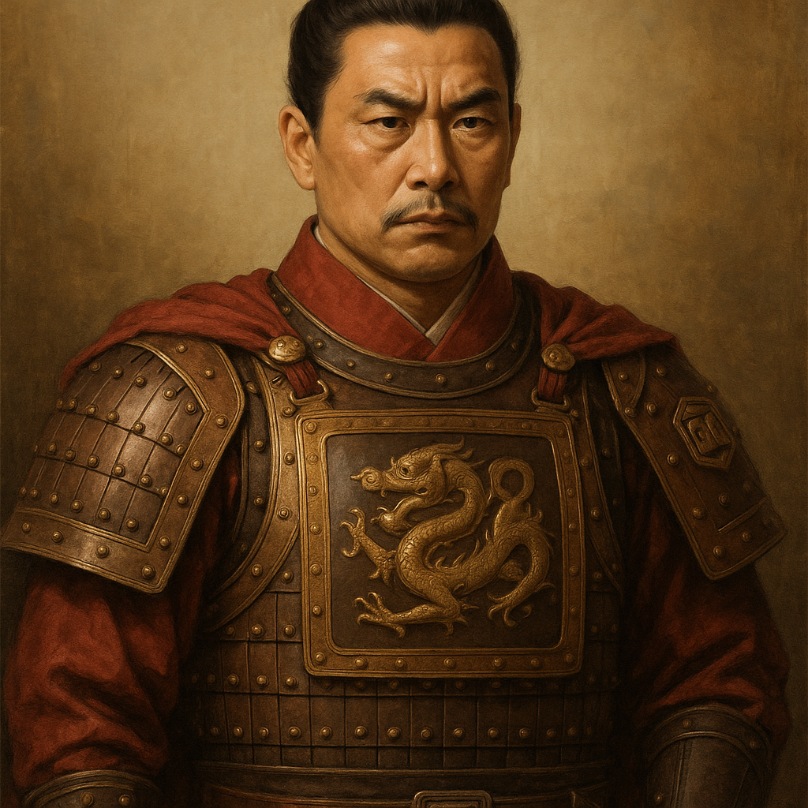
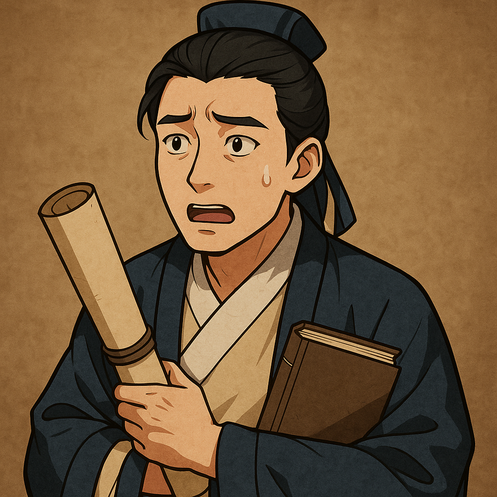
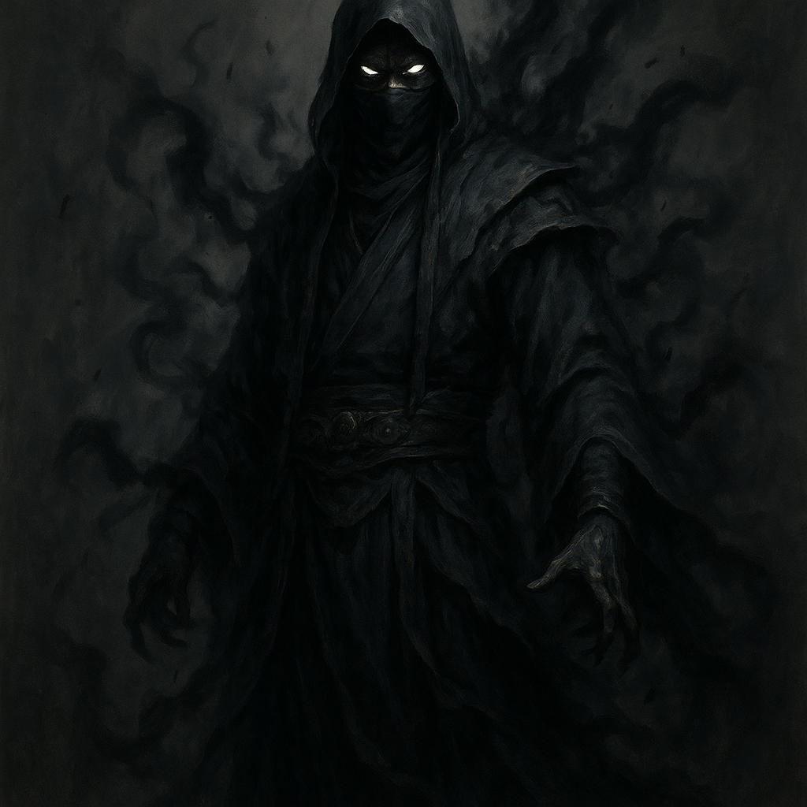
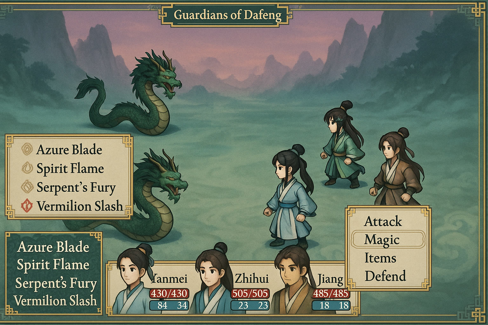
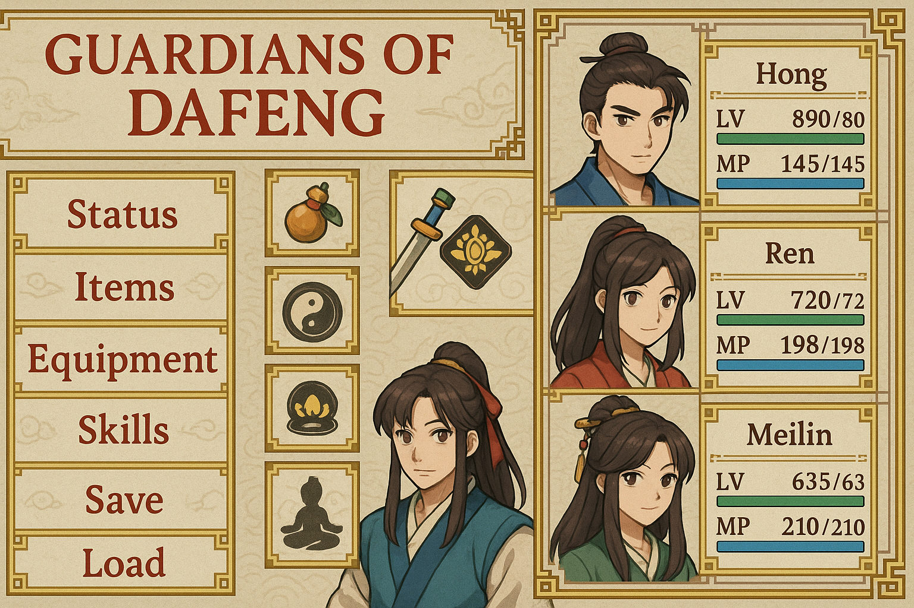
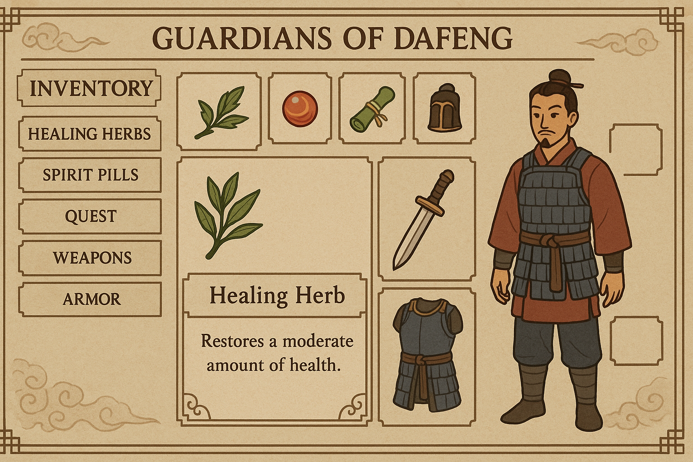
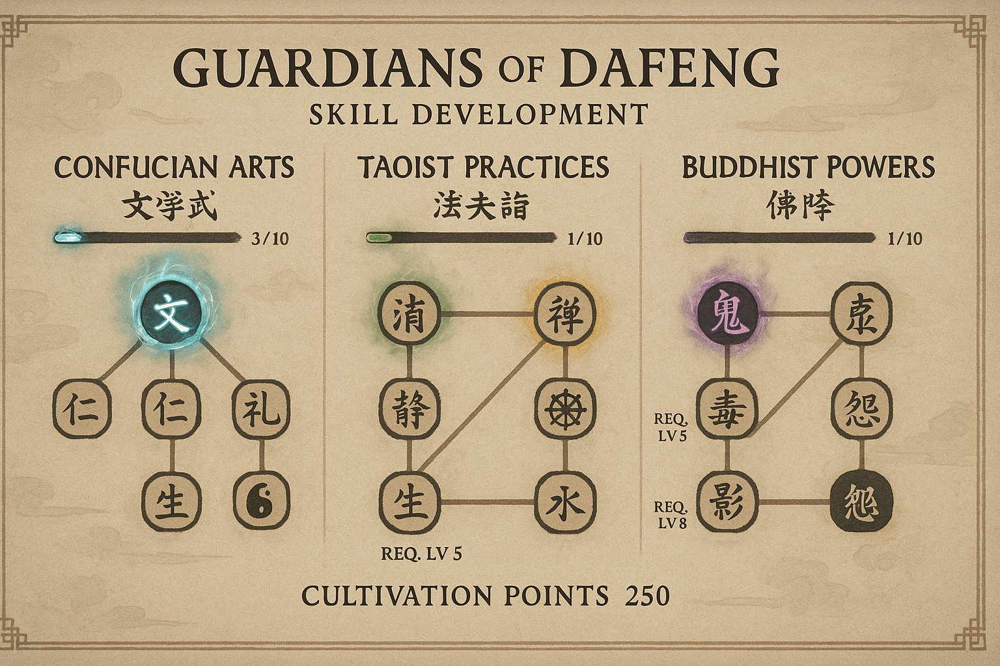

# Guardians of the Dafeng RPG

A comprehensive RPG adventure set in the mystical world of ancient China, inspired by the "Guardians of the Dafeng" series. Experience a rich narrative combining investigation, cultivation, and martial arts in a beautifully crafted traditional Chinese setting.

## 🎬 Gameplay Showcase

*Experience authentic RPG Maker MZ gameplay in the mystical world of Dafeng with traditional Chinese cultivation themes. Watch characters move through detailed environments, explore quest locations, develop cultivation abilities, and embark on epic adventures. This 32-second showcase demonstrates realistic gameplay mechanics and immersive RPG features.*

## 🗺️ World Map

*Navigate through the ancient world of Dafeng, from the scholarly academy to mystical lakes and imperial capitals.*

## 🌟 Main Characters

| Portrait | Name | Description |
|---|---|---|
|  | **Xu Qi'an** | The protagonist, a young scholar with a sharp mind and a strong sense of justice. He becomes entangled in a series of mysteries that threaten the Dafeng Empire. |
|  | **Master Chen** | The wise and kind master of the Dafeng Academy. He serves as a mentor to Xu Qi'an and guides him on his cultivation journey. |
|  | **Captain Li** | The stern and disciplined captain of the Imperial Guard. He is a powerful warrior and a loyal servant of the Emperor. |
|  | **Scholar Wei** | A young scholar from the Dafeng Academy who goes missing under mysterious circumstances, sparking the first main quest. |
|  | **Shadow Master** | The enigmatic leader of a mysterious organization that operates in the shadows, posing a significant threat to the empire. |

## 🎮 Game Features

### Core Gameplay
- **Investigation System**: Solve mysteries using observation, deduction, and interrogation skills
- **Cultivation Mechanics**: Develop spiritual and martial abilities through meditation and practice
- **Faction-Based Magic**: Choose from Confucian Arts, Taoist Practices, Buddhist Powers, or Sorcery
- **Rich Storyline**: 5 main quests and 12 side quests with 15-20 hours of content

### Technical Features
- **Complete RPG Maker MZ Project**: Fully functional and ready to edit
- **Custom Visual Assets**: 15 hand-crafted location maps, character portraits, and UI mockups with authentic Chinese aesthetics
- **Comprehensive Audio System**: 40 placeholder audio files including BGM, sound effects, and ambient sounds with theme-appropriate descriptions
- **Professional Documentation**: Complete walkthrough and user guides

## 🖼️ Game Interfaces

| Interface | Description |
|---|---|
|  | **Combat System**: Engage in turn-based battles using traditional cultivation abilities and martial arts. |
|  | **Menu System**: Navigate through a traditional Chinese-themed menu with elegant design and intuitive controls. |
|  | **Inventory Management**: Organize your items, including healing herbs, spirit pills, and quest-related artifacts. |
|  | **Skill Development**: Customize your character's abilities by investing cultivation points into different skill trees. |

## 🔧 Technical Specifications

### RPG Maker MZ Compatibility
- **Version**: Compatible with RPG Maker MZ 1.8.0 and later
- **Project Structure**: Complete and properly organized
- **Database**: All required JSON files with valid data structures
- **Assets**: Properly sized and formatted for RPG Maker MZ

### System Requirements
- **RPG Maker MZ Runtime**: Version 1.8.0 or later
- **Operating System**: Windows 10/11, macOS 10.15+, or Linux Ubuntu 18.04+
- **Memory**: 4 GB RAM minimum, 8 GB recommended
- **Storage**: 500 MB available space

## 🚀 Getting Started

### For Players
1. Download the complete project from this repository
2. Extract all files to your desired location
3. Open the project in RPG Maker MZ or run the web version
4. Start your adventure in the mystical world of Dafeng

### For Developers
1. Clone this repository
2. Open `Game.rmmzproject` in RPG Maker MZ
3. All assets and data files are properly organized and ready for editing
4. Refer to the documentation in the `docs/` folder for quest details

## 📖 Documentation

- **[Complete Walkthrough](docs/WALKTHROUGH.md)**: Detailed solutions for all quests
- **[User Guide](docs/USER_GUIDE.md)**: Controls, mechanics, and gameplay tips

## 📊 Content Statistics

- **Total Quests**: 17 (5 main + 12 side)
- **Estimated Playtime**: 15-20 hours
- **Character Levels**: 1-50 progression system
- **Visual Maps**: 15 unique locations with character portraits and a stylized world map
- **Audio Files**: 40 placeholder tracks and effects
- **Documentation**: 2 comprehensive guides
- **Project Files**: Complete RPG Maker MZ structure

## 🔄 Version History

### Version 2.7.0 - Visual Showcase Edition (Current)
- Added gameplay showcase video
- Included main character portraits and descriptions
- Integrated game interface mockups
- Updated README.md with comprehensive visual content

---

**Ready to begin your cultivation journey? Download the project and start exploring the mystical world of ancient China!**
