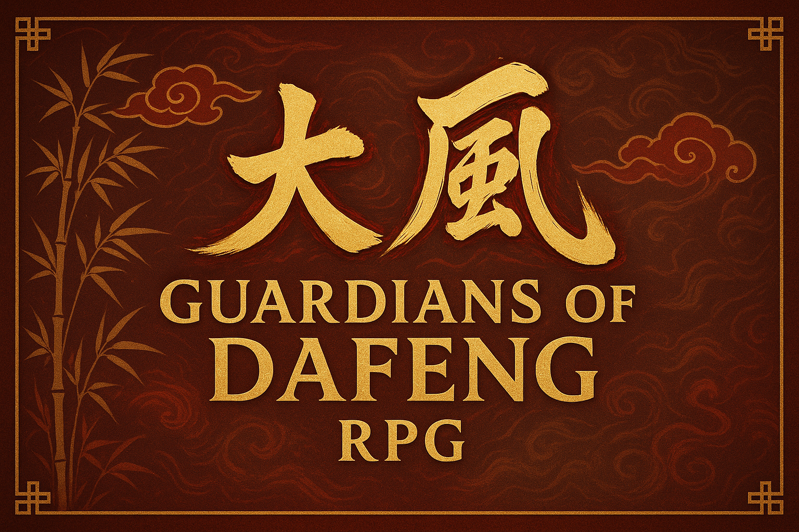

# Guardians of the Dafeng - User Guide

## Table of Contents
- [Getting Started](#getting-started)
- [Game Mechanics](#game-mechanics)
- [Controls](#controls)
- [Character Systems](#character-systems)
- [Tips for Beginners](#tips-for-beginners)

---

## Getting Started

### System Requirements
- **RPG Maker MZ Runtime**: Version 1.8.0 or later
- **Operating System**: Windows 10/11, macOS 10.15+, or Linux Ubuntu 18.04+
- **Memory**: 4 GB RAM minimum, 8 GB recommended
- **Storage**: 500 MB available space
- **Graphics**: DirectX 11 compatible graphics card

### Installation
1. Download the game files from the repository
2. Extract all files to your desired game directory
3. Run the executable file or open index.html in a web browser
4. Ensure all asset files are in the correct subdirectories

---

## Game Mechanics

### Investigation System
The Investigation system is core to solving mysteries and uncovering secrets.

**How to Use**:
- Press **SPACE** near interactive objects to investigate
- Look for visual cues like sparkles or highlighted areas
- Some investigations require specific skill levels
- Combine clues in your journal to solve puzzles

### Cultivation System
Develop your character's spiritual and martial abilities through cultivation.

**Cultivation Types**:
- **Physical Cultivation**: Enhances strength, speed, and endurance
- **Spiritual Cultivation**: Improves magical abilities and energy capacity
- **Mental Cultivation**: Increases wisdom, memory, and learning speed

### Faction Magic Systems

#### Confucian Arts

*Master Chen, a wise Confucian master*
**Philosophy**: Knowledge and righteousness as sources of power
**Abilities**:
- **Scholar's Insight**: Reveal hidden knowledge and secrets
- **Righteous Fury**: Damage increases when fighting evil enemies
- **Protective Wisdom**: Create barriers using accumulated knowledge

#### Taoist Practices
**Philosophy**: Harmony with natural forces and balance
**Abilities**:
- **Elemental Mastery**: Control over fire, water, earth, air, and wood
- **Yin-Yang Balance**: Switch between offensive and defensive stances
- **Natural Healing**: Restore health using natural energy

#### Buddhist Powers
**Philosophy**: Compassion and enlightenment through suffering
**Abilities**:
- **Compassionate Healing**: Powerful healing abilities for self and others
- **Karmic Justice**: Reflect damage back to attackers
- **Enlightened Defense**: Immunity to mental attacks and illusions

#### Sorcery
**Philosophy**: Raw power through forbidden knowledge
**Abilities**:
- **Dark Magic**: Powerful offensive spells with health costs
- **Soul Manipulation**: Control over spirits and undead creatures
- **Forbidden Rituals**: High-risk, high-reward magical effects

---

## Controls

### Keyboard Controls
- **Arrow Keys / WASD**: Move character
- **ENTER / SPACE**: Interact / Confirm
- **ESC / X**: Cancel / Open menu
- **SHIFT**: Run (hold while moving)
- **CTRL**: Skip text / Fast forward
- **ALT**: Hide message window
- **F1**: Open help screen
- **F4**: Toggle fullscreen
- **F5**: Reload game
- **F12**: Open debug menu (if enabled)

### Gamepad Support
The game supports most standard gamepads:
- **Left Stick / D-Pad**: Move character
- **A Button (Xbox) / X Button (PlayStation)**: Interact / Confirm
- **B Button (Xbox) / Circle Button (PlayStation)**: Cancel / Menu
- **Y Button (Xbox) / Triangle Button (PlayStation)**: Open main menu

---

## Character Systems

*Xu Qi'an, the protagonist*

### Character Stats
- **Level**: Overall character progression (1-50)
- **Health Points (HP)**: Character's life force
- **Magic Points (MP)**: Energy for using special abilities
- **Cultivation Points (CP)**: Progress in spiritual development

### Primary Attributes
- **Strength**: Physical power and melee damage
- **Agility**: Speed, evasion, and critical hit chance
- **Intelligence**: Magical power and problem-solving ability
- **Wisdom**: Spiritual insight and cultivation speed
- **Charisma**: Social interactions and leadership

---

## Tips for Beginners

### Character Development
1. **Choose Your Path Early**: Decide on Confucian, Taoist, Buddhist, or Sorcery focus
2. **Balance Your Stats**: Don't neglect any attribute completely
3. **Practice Cultivation**: Regular meditation sessions improve all abilities
4. **Learn from Masters**: Seek out teachers for advanced techniques

### Quest Management
1. **Read Quest Descriptions**: They often contain important hints
2. **Check Your Journal**: Review objectives and collected clues regularly
3. **Don't Rush**: Take time to explore and understand the story
4. **Save Often**: Create multiple save files for different story branches

---

## Quest Information

### Main Quest Overview
The game features **5 major storylines**:

1. **The Missing Scholar**: Academic mystery investigation
2. **The Sangbo Lake Mystery**: Supernatural phenomenon
3. **The Shadow in the Capital**: Political intrigue
4. **The Lost Heirloom**: Ancient artifact recovery
5. **The Celestial Tournament**: Martial arts competition

### Side Quest Categories
**12 additional quests** provide extra content:

- **Temple Cleansing**: Spiritual purification missions
- **Rescue Operations**: Saving people in danger
- **Curse Breaking**: Removing magical afflictions
- **Resource Gathering**: Collecting rare materials
- **Combat Challenges**: Testing martial prowess
- **Investigation Cases**: Solving local mysteries

---

**Game Version**: 2.5.0  
**Total Content**: 17 Quests, 10+ Hours of Gameplay
